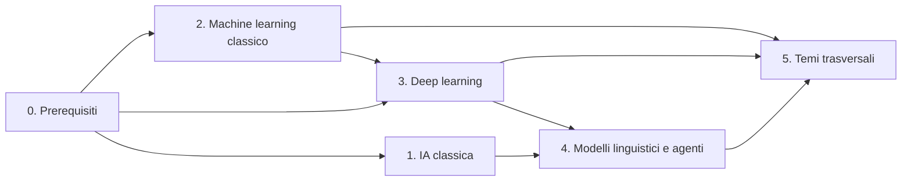

# Programma di intelligenza artificiale

La struttura del corso universitario di intelligenza artificiale e il sottoinsieme che si può trattare in quinta. Scritto da Claude il 5 ottobre 2026 su richiesta di Alessandro. La struttura a blocchi è decisa (vedi [[2026-10-05 Il corso di intelligenza artificiale ha quattro blocchi ordinati da un grafo dei prerequisiti]]); l'elenco dei capitoli, i loro prerequisiti e gli argomenti sono una proposta da rileggere, confrontata il 5 ottobre 2026 con i syllabus di tredici atenei (vedi [[Confronto del programma di intelligenza artificiale con i syllabus universitari]]). L'idea da cui nasce è in [[Intelligenza artificiale in quinta e all'università]]. Niente è stato applicato agli alberi delle lezioni né al database.

## Fonti

- Il corso "AI Engineering from Scratch" di Rohit Ghumare (github.com/rohitg00/ai-engineering-from-scratch, licenza MIT, letto il 5 ottobre 2026), qui abbreviato in AIEFS. Ha 523 lezioni in 20 fasi; 341 sono su modelli linguistici, agenti e produzione (fasi 10-19). Ogni rimando "AIEFS" qui sotto è stato controllato sull'elenco delle lezioni; "manca" vuol dire che non ha una lezione dedicata, "citato" che l'argomento compare solo dentro altre lezioni.
- Per le parti che in AIEFS mancano, i manuali di riferimento sono: Russell e Norvig, "Artificial Intelligence: A Modern Approach" (quarta edizione, 2020) per l'IA classica; Sutton e Barto, "Reinforcement Learning: An Introduction" (seconda edizione, 2018); Goodfellow, Bengio e Courville, "Deep Learning" (2016); Bishop, "Pattern Recognition and Machine Learning" (2006); Hastie, Tibshirani e Friedman, "The Elements of Statistical Learning" (seconda edizione, 2009); Hamilton, "Graph Representation Learning" (2020). Edizioni e anni citati a memoria: da verificare.
- Per la quinta: l'albero di informatica di Sapiens (`docs/lezioni/informatica/albero.md`), che segue il DM 211/2010 e la bozza delle nuove Indicazioni nazionali del 22 aprile 2026. Vedi [[Programma ministeriale]].

## Che cosa è stato verificato di AIEFS

Qualità: buona nelle fasi 1-3, dove le lezioni hanno una mediana di 19-22 KB di testo e codice da 340 a 970 righe; più sottile dalle fasi 6-9, con una mediana di 9-11 KB e codice da 113 a 229 righe nel reinforcement learning. Lette per intero due lezioni (introduzione al machine learning, SVM), le scalette di altre nove, ed eseguiti quattro script (SVM, clustering, Q-learning, PPO): tutti terminano senza errori con risultati sensati. Le fasi 10-19 non sono state verificate nel contenuto.

Difetti trovati: formule in testo semplice, senza LaTeX; alcuni diagrammi Mermaid che non mostrano niente (il margine delle SVM); nella lezione introduttiva "aggiungere dati migliora le prestazioni" è messo tra i sintomi dell'overfitting, mentre è un rimedio. Il pubblico è fatto di sviluppatori adulti, in inglese, con Python e algebra lineare come prerequisiti.

Idee di formato da riprendere, indipendenti dai contenuti: il tutor come skill di un coding agent (`start-learning`, `learn`, `check-understanding`), il quiz di piazzamento di dieci domande, la tabella "Key Terms" con le colonne "cosa si dice" e "cosa significa davvero".

## Struttura del corso

### I blocchi

Un capitolo 0 di prerequisiti, quattro blocchi che fanno la spina del corso, un blocco trasversale. L'ordine dei quattro blocchi è quello della storia, e dal blocco 2 in poi anche quello dei prerequisiti: ogni blocco nasce da un limite del precedente. I blocchi 1 e 2 non dipendono l'uno dall'altro e si possono studiare in parallelo (dal confronto con i syllabus: nessun corso di machine learning letto chiede un corso di IA classica).

| Blocco | Che cosa contiene | Chi scrive le regole | Periodo |
|---|---|---|---|
| 0. Prerequisiti | Algebra lineare, analisi, probabilità, statistica, ottimizzazione | | |
| 1. IA classica | Ricerca, giochi, vincoli, logica, pianificazione, ragionamento probabilistico | Una persona scrive le regole | dal 1956 |
| 2. Machine learning classico | Modelli lineari, alberi, SVM, clustering, riduzione della dimensionalità | Le regole si imparano dai dati; le caratteristiche le sceglie una persona | dagli anni Novanta |
| 3. Deep learning | Reti neurali, architetture, modelli generativi, visione, linguaggio, audio | Si imparano anche le caratteristiche | dal 2012 |
| 4. Modelli linguistici e agenti | Dal transformer agli LLM, il loro uso, il multimodale, gli agenti | Un solo modello pre-addestrato per molti compiti | dal 2017 |
| 5. Temi trasversali | Equità, interpretabilità, sicurezza, regole, produzione | | |

I modelli linguistici sono deep learning a tutti gli effetti: il blocco 4 dipende dal transformer del blocco 3. Stanno in un blocco a parte per il peso che hanno oggi e perché è lì che arriva chi viene da fuori. Il corso lo dice all'inizio del blocco 4.

### Ogni blocco è un corso

Deciso da Alessandro il 5 ottobre 2026 (vedi [[2026-10-05 Ogni blocco dell'intelligenza artificiale è un corso a sé]]): i blocchi dall'1 al 5 diventano materie separate, come Analisi 1 e Analisi 2. I prerequisiti del blocco 0 non fanno parte dell'area: algebra lineare, analisi, probabilità e statistica sono corsi di ogni laurea in ingegneria e staranno in Sapiens come esami indipendenti.

Stima di Claude della misura, non discussa. Un corso universitario da 6 crediti ha circa 48 ore di lezione; contando due o tre lezioni di Sapiens per ogni lezione in aula da due ore, sono 50-70 lezioni di Sapiens (il rapporto è da verificare sul capitolo pilota).

| Corso | Capitoli | Lezioni stimate | Giudizio |
|---|---|---|---|
| IA classica | 1.1-1.9 | 40-50 | un corso da 6 crediti |
| Machine learning classico | 2.1-2.11 | 50-60 | un corso da 6 crediti, abbondante |
| Deep learning | 3.1-3.9, 3.13 | 50-60 | un corso da 6 crediti, abbondante |
| Visione, linguaggio naturale, audio | 3.10, 3.11, 3.12 | 20-30 ciascuno, se trattati per intero | tre campi interi: non stanno nel corso di deep learning. O diventano corsi a scelta, o si riducono a un capitolo di 4-5 lezioni ciascuno |
| Modelli linguistici | 4.1-4.7 | 30-40 | un corso, più leggero |
| Agenti | 4.8-4.10 | 15-20 | mezzo corso, la parte che cambia più in fretta |
| Temi trasversali | 5.1-5.8 | 25-30 | un corso leggero; la produzione (5.7) si può staccare |

In tutto da 230 a 290 lezioni senza i tre campi a scelta. I crediti danno solo l'ordine di grandezza del lavoro: un corso è lungo quanto chiede il suo argomento (vedi [[2026-10-05 I corsi universitari non hanno una misura fissa]]).

Modelli linguistici e agenti sono due corsi diversi (Alessandro, 5 ottobre 2026). Nel corso sugli agenti vanno tenuti distinti i sistemi multi-agente e gli agenti basati su un modello linguistico, che sono sempre un LLM.

Il primo capitolo che si scrive sono le reti neurali di base, 3.1 e 3.2: vedi [[2026-10-05 Il primo capitolo di intelligenza artificiale sono le reti neurali]].

Dal 6 ottobre 2026 i sei corsi sono nella pagina dell'università del sito, con 50 capitoli e 286 lezioni, vuote tranne "Il percettrone" (Deep learning, capitolo 3.1). Gli alberi, con i titoli di tutte le lezioni, sono in `docs/lezioni/universita/intelligenza-artificiale/alberi/`: i titoli delle lezioni sono una prima divisione degli argomenti, da rivedere capitolo per capitolo. Il blocco 0 e il capitolo 5.8 (progetti) non sono nel sito. Vedi [[2026-10-05 Intelligenza artificiale all'università]].

### Il grafo dei prerequisiti

L'ordine di studio lo dà un grafo orientato senza cicli, con un solo tipo di arco, come per le superiori (vedi [[2026-09-25 I prerequisiti si scrivono per lezione, con un solo tipo di arco]]). Qui sotto ogni capitolo dichiara i capitoli da cui dipende; quando si scrivono le lezioni gli archi scendono al livello della lezione. Un argomento che sta a cavallo tra due blocchi va nel blocco in cui cadono i suoi prerequisiti, e non importa in quale finisce: l'ordine lo dà il grafo.

### Gli assi di classificazione

Gli assi sono etichette sulle lezioni e non danno l'ordine. Servono a chi studia per collocare un modello: "k-means è non supervisionato, fa clustering, è a centroidi, non è una rete, si addestra con un'alternanza di due passi".

| Asse | Valori |
|---|---|
| Tipo di apprendimento | nessuno (regole scritte a mano), supervisionato, non supervisionato, auto-supervisionato, semi-supervisionato, per rinforzo |
| Compito | ricerca e pianificazione, classificazione, regressione, clustering, riduzione della dimensionalità, generazione, previsione di sequenze, decisione e controllo, recupero |
| Famiglia del modello | simbolico, probabilistico, lineare, a istanze, ad albero, a kernel, d'insieme, rete neurale |
| Architettura (solo reti) | a strati densi, convoluzionale, ricorrente, transformer, su grafi, autoencoder |
| Tecnica di addestramento | nessuna, forma chiusa, discesa del gradiente, EM, evolutiva, differenze temporali, avversaria, diffusione |

I valori sono una prima proposta: si fissano quando si etichettano le lezioni.

### Dove sta l'apprendimento per rinforzo

Non è un blocco né un macroargomento (Alessandro, 5 ottobre 2026). Si presenta in 2.1, accanto al supervisionato e al non supervisionato, con esempi che non chiedono prerequisiti, e poi torna declinato sui singoli argomenti:

- 1.9: i processi decisionali di Markov, quando il modello dell'ambiente è noto e non c'è niente da imparare;
- 2.1: la definizione e la distinzione dagli altri due tipi;
- 2.11: i metodi tabellari, quando il modello non è noto;
- 3.13: gli stessi metodi con una rete al posto della tabella;
- 4.2: l'allineamento di un modello linguistico con il giudizio umano;
- 4.9: più agenti che imparano insieme.

I capitoli 2.11 e 3.13 sono una proposta di Claude, da confermare: i concetti propri del rinforzo (valore di uno stato, equazione di Bellman, esplorare o sfruttare, differenze temporali) non appartengono a nessuna architettura, e senza un capitolo che li tenga insieme andrebbero rispiegati ogni volta. L'alternativa è sciogliere anche questi due capitoli dentro gli altri.

## Capitoli

Cinquantasette capitoli. Per ciascuno: gli argomenti, i prerequisiti (numeri di capitolo) e dove sta in AIEFS.

### Blocco 0. Prerequisiti

Non sono intelligenza artificiale e non si scrivono dentro quest'area: algebra lineare, analisi, probabilità e statistica sono corsi di ogni laurea in ingegneria e staranno in Sapiens come esami indipendenti (Alessandro, 5 ottobre 2026). I capitoli qui sotto elencano solo che cosa i corsi di intelligenza artificiale usano di quei corsi, per poter scrivere gli archi del grafo. Ottimizzazione e teoria dell'informazione di solito non hanno un esame loro: dove si spiegano è da decidere. Si dà per nota la programmazione in Python.

#### 0.1 Algebra lineare
- Argomenti: vettori, matrici, prodotto scalare, trasformazioni lineari, sistemi lineari, norme e distanze, autovalori e autovettori, decomposizione ai valori singolari, tensori.
- Prerequisiti: nessuno.
- In AIEFS: fase 1, lezioni 1-3, 11, 12, 14, 17.

#### 0.2 Analisi in più variabili
- Argomenti: derivate parziali, gradiente, jacobiana, hessiana, regola della catena.
- Prerequisiti: 0.1.
- In AIEFS: fase 1, lezioni 4-5.

#### 0.3 Probabilità
- Argomenti: variabili aleatorie, distribuzioni, valore atteso e varianza, probabilità condizionata, teorema di Bayes, catene di Markov, metodi di campionamento (Monte Carlo, per importanza, MCMC).
- Prerequisiti: nessuno.
- In AIEFS: fase 1, lezioni 6, 7, 16, 22.

#### 0.4 Statistica
- Argomenti: stima, massima verosimiglianza, massimo a posteriori, intervalli di confidenza, test di ipotesi.
- Prerequisiti: 0.3.
- In AIEFS: fase 1, lezione 15.

#### 0.5 Ottimizzazione
- Argomenti: discesa del gradiente (batch, stocastica, mini-batch), momento, problemi convessi e non convessi, moltiplicatori di Lagrange, condizioni KKT, stabilità numerica.
- Prerequisiti: 0.2.
- In AIEFS: fase 1, lezioni 8, 13, 18.

#### 0.6 Teoria dell'informazione
- Argomenti: entropia, entropia incrociata, divergenza di Kullback-Leibler, informazione mutua.
- Prerequisiti: 0.3.
- In AIEFS: fase 1, lezione 9.

### Blocco 1. IA classica

Sistemi in cui le regole le scrive una persona e la macchina cerca, deduce o calcola. In AIEFS manca quasi tutto: la fonte è Russell e Norvig.

#### 1.1 Che cos'è l'intelligenza artificiale
- Argomenti: le definizioni (pensare o agire, come un umano o razionalmente), il test di Turing, IA ristretta e generale; l'agente razionale e i tipi di ambiente; la storia (Dartmouth 1956, il percettrone e il primo inverno, i sistemi esperti e il secondo inverno, l'apprendimento statistico, il deep learning dal 2012, i transformer dal 2017); la mappa del corso e gli assi di classificazione.
- Prerequisiti: nessuno.
- In AIEFS: manca.

#### 1.2 Ricerca nello spazio degli stati
- Argomenti: problemi come ricerca; ricerca in ampiezza, in profondità, a costo uniforme, ad approfondimento iterativo, bidirezionale; ricerca greedy e A*, euristiche ammissibili e consistenti, IDA*.
- Prerequisiti: 1.1.
- In AIEFS: manca.

#### 1.3 Ricerca locale e algoritmi evolutivi
- Argomenti: hill climbing, simulated annealing, ricerca tabu, beam search; algoritmi genetici, strategie evolutive, programmazione genetica, neuroevoluzione; ottimizzazione a sciame di particelle e a colonie di formiche.
- Prerequisiti: 1.2.
- In AIEFS: PSO e ACO (fase 16, lezione 19) e metodi evolutivi (fase 14, lezione 11) solo applicati agli agenti.

#### 1.4 Ricerca con avversario
- Argomenti: giochi a somma zero, minimax, potatura alfa-beta, funzioni di valutazione, expectiminimax, ricerca ad albero Monte Carlo; teoria dei giochi oltre la somma zero (equilibrio di Nash, strategie miste, giochi in forma estesa).
- Prerequisiti: 1.2.
- In AIEFS: MCTS citato.

#### 1.5 Vincoli e soddisfacibilità
- Argomenti: problemi di soddisfacimento di vincoli, backtracking, consistenza d'arco (AC-3), euristiche di ordinamento; soddisfacibilità booleana e risolutori SAT.
- Prerequisiti: 1.2.
- In AIEFS: manca.

#### 1.6 Logica e rappresentazione della conoscenza
- Argomenti: logica proposizionale (forme normali, risoluzione); logica del primo ordine (unificazione, concatenazione in avanti e all'indietro); programmazione logica; sistemi esperti e sistemi a regole; reti semantiche, frame e logiche descrittive; ontologie e grafi di conoscenza; ragionamento temporale, calcolo delle situazioni e problema del frame; logica epistemica e revisione delle credenze; logica fuzzy; ragionamento non monotono; IA neurosimbolica.
- Prerequisiti: 1.1.
- In AIEFS: manca; solo l'estrazione di relazioni per i grafi di conoscenza (fase 5, lezione 26).

#### 1.7 Pianificazione
- Argomenti: STRIPS e PDDL, pianificazione nello spazio degli stati e dei piani (ordine parziale), GraphPlan, pianificazione come SAT, reti gerarchiche di compiti; pianificazione con osservabilità parziale e con più agenti.
- Prerequisiti: 1.2, 1.6.
- In AIEFS: HTN solo applicato agli agenti (fase 14, lezione 11).

#### 1.8 Ragionamento probabilistico
- Argomenti: reti bayesiane, indipendenza condizionata, inferenza esatta e approssimata; campi aleatori di Markov; modelli di Markov nascosti (forward, Viterbi, Baum-Welch); filtro di Kalman e filtro a particelle; apprendimento nei modelli probabilistici e variabili latenti; inferenza causale (grafi causali, interventi, controfattuali).
- Prerequisiti: 0.3, 1.1.
- In AIEFS: manca; reti bayesiane, modelli di Markov nascosti e Kalman sono citati.

#### 1.9 Decisioni in sequenza
- Argomenti: utilità e teoria delle decisioni; processi decisionali di Markov; equazioni di Bellman; iterazione dei valori e della politica.
- Prerequisiti: 0.3, 1.2.
- In AIEFS: fase 9, lezioni 1-2.

### Blocco 2. Machine learning classico

Le regole si imparano dai dati, ma le caratteristiche su cui lavora il modello le sceglie ancora una persona.

#### 2.1 Imparare dai dati
- Argomenti: regole scritte e regole imparate; i tipi di apprendimento (supervisionato, non supervisionato, per rinforzo, semi-supervisionato, auto-supervisionato) con un esempio ciascuno; classificazione e regressione; funzioni di perdita; quando non usare l'apprendimento automatico.
- Prerequisiti: 0.4.
- In AIEFS: fase 2, lezione 1.

#### 2.2 Valutare e generalizzare
- Argomenti: insiemi di addestramento, validazione e test; convalida incrociata; sottoadattamento e sovradattamento; distorsione e varianza; regolarizzazione; metriche (accuratezza, precisione, richiamo, F1, matrice di confusione, ROC e AUC, errore quadratico medio); calibrazione; confronto statistico tra due modelli (test, bootstrap, confronti multipli); apprendimento PAC, dimensione di Vapnik-Chervonenkis, teorema "no free lunch".
- Prerequisiti: 2.1.
- In AIEFS: fase 2, lezioni 9-10. PAC e dimensione VC mancano.

#### 2.3 Modelli lineari
- Argomenti: regressione lineare (minimi quadrati, forma chiusa e discesa del gradiente), ridge, lasso ed elastic net, regressione polinomiale; regressione logistica e softmax; il percettrone come classificatore lineare; analisi discriminante lineare e quadratica e classificatori generativi gaussiani.
- Prerequisiti: 2.1, 0.1, 0.5.
- In AIEFS: fase 2, lezioni 2-3. L'analisi discriminante manca (da verificare).

#### 2.4 Vicini più prossimi e Naive Bayes
- Argomenti: k vicini più prossimi e la scelta della distanza; la maledizione della dimensionalità; Naive Bayes.
- Prerequisiti: 2.1, 0.3.
- In AIEFS: fase 2, lezioni 6 e 14.

#### 2.5 Alberi e metodi d'insieme
- Argomenti: alberi di decisione (entropia, indice di Gini, ID3, CART, potatura); bagging e foreste casuali; AdaBoost, gradient boosting, XGBoost; stacking e voto.
- Prerequisiti: 2.2, 0.6.
- In AIEFS: fase 2, lezioni 4 e 11.

#### 2.6 Macchine a vettori di supporto e metodi a kernel
- Argomenti: margine massimo, margine morbido, hinge loss, formulazione duale, trucco del kernel (lineare, polinomiale, RBF), regressione a vettori di supporto; processi gaussiani.
- Prerequisiti: 2.3, 0.3, 0.5.
- In AIEFS: fase 2, lezione 5. I processi gaussiani mancano (da verificare).

#### 2.7 Preparare i dati e scegliere un modello
- Argomenti: pulizia, codifica, normalizzazione; costruzione e selezione delle caratteristiche; ricerca degli iperparametri (a griglia, casuale, bayesiana); apprendimento attivo; qualità delle etichette; dati sbilanciati; pipeline di addestramento.
- Prerequisiti: 2.2.
- In AIEFS: fase 2, lezioni 8, 12, 13, 17, 18.

#### 2.8 Clustering
- Argomenti: k-means e scelta di k (gomito, silhouette); clustering gerarchico; DBSCAN; misture gaussiane con l'algoritmo EM; clustering spettrale; stima di densità a kernel.
- Prerequisiti: 2.1, 0.1.
- In AIEFS: fase 2, lezione 7. Il clustering spettrale manca.

#### 2.9 Riduzione della dimensionalità
- Argomenti: PCA, PCA con kernel, analisi fattoriale, analisi delle componenti indipendenti, fattorizzazione non negativa di matrici, t-SNE, UMAP; mappe auto-organizzanti.
- Prerequisiti: 2.1, 0.1.
- In AIEFS: fase 1, lezione 10. Le mappe auto-organizzanti mancano.

#### 2.10 Altri compiti
- Argomenti: rilevamento di anomalie (isolation forest, SVM a una classe); regole di associazione (Apriori); sistemi di raccomandazione (filtraggio collaborativo, fattorizzazione di matrici); serie storiche.
- Prerequisiti: 2.3, 2.8.
- In AIEFS: fase 2, lezioni 15-16. Regole di associazione e raccomandazione mancano (da verificare).

#### 2.11 Apprendimento per rinforzo tabellare
- Argomenti: banditi a più braccia (epsilon-greedy, UCB, campionamento di Thompson); metodi Monte Carlo; differenze temporali (SARSA, Q-learning, metodi a n passi, TD(lambda)); strategie di esplorazione; approssimazione lineare della funzione valore.
- Prerequisiti: 1.9, 2.1.
- In AIEFS: fase 9, lezioni 3-4. I banditi mancano. Fonte: Sutton e Barto.

### Blocco 3. Deep learning

Le reti neurali imparano anche le caratteristiche. I capitoli 3.1-3.3 sono le basi, 3.4-3.7 le architetture, 3.8-3.9 le rappresentazioni e la generazione, 3.10-3.13 i campi di applicazione.

#### 3.1 Dal neurone alla rete
- Argomenti: il neurone artificiale e il percettrone; il limite dello XOR; reti a più strati; funzioni di attivazione (sigmoide, tanh, ReLU e varianti, softmax); il teorema di approssimazione universale e perché serve la profondità.
- Prerequisiti: 2.3.
- In AIEFS: fase 3, lezioni 1, 2, 4.

#### 3.2 Retropropagazione
- Argomenti: il grafo di calcolo; la retropropagazione dell'errore; differenziazione automatica; un piccolo framework scritto a mano.
- Prerequisiti: 3.1, 0.2.
- In AIEFS: fase 3, lezioni 3 e 10; fase 1, lezione 5.

#### 3.3 Addestrare una rete
- Argomenti: funzioni di perdita; ottimizzatori (SGD, momento, RMSProp, Adam, AdamW) e piani del tasso di apprendimento; inizializzazione dei pesi (Xavier, He), gradienti che svaniscono o esplodono; regolarizzazione (decadimento dei pesi, dropout, normalizzazione per batch e per strato, arresto anticipato, aumento dei dati); PyTorch e JAX; diagnosi di una rete che non impara; generalizzazione delle reti (sovraparametrizzazione, doppia discesa); addestramento su più GPU.
- Prerequisiti: 3.2, 0.5, 2.2.
- In AIEFS: fase 3, lezioni 5-9, 11-13.

#### 3.4 Reti convoluzionali
- Argomenti: convoluzione e pooling; LeNet, AlexNet, VGG, Inception, ResNet e le connessioni residue; trasferimento dell'apprendimento.
- Prerequisiti: 3.3.
- In AIEFS: fase 4, lezioni 2-5.

#### 3.5 Reti ricorrenti
- Argomenti: la rete di Elman; retropropagazione nel tempo; LSTM e GRU; reti bidirezionali; modelli da sequenza a sequenza; modelli a spazio di stato.
- Prerequisiti: 3.3.
- In AIEFS: una sola lezione (fase 5, lezione 8) più seq2seq (fase 5, lezione 9). Fonte: Goodfellow, Bengio e Courville.

#### 3.6 Attenzione e transformer
- Argomenti: il meccanismo di attenzione; auto-attenzione e attenzione a più teste; codifica posizionale; encoder e decoder; varianti dell'attenzione; miscela di esperti.
- Prerequisiti: 3.5.
- In AIEFS: fase 5, lezione 10; fase 7, lezioni 1-5, 11, 15.

#### 3.7 Reti su grafi
- Argomenti: grafi come dati (matrice di adiacenza, laplaciano); scambio di messaggi; GCN, GraphSAGE, GAT; compiti su nodi, archi e grafi interi.
- Prerequisiti: 3.3, 0.1.
- In AIEFS: solo lo scambio di messaggi (fase 1, lezione 21). Fonte: Hamilton.

#### 3.8 Imparare rappresentazioni
- Argomenti: autoencoder; apprendimento auto-supervisionato e contrastivo; embedding; reti di Hopfield e macchine di Boltzmann.
- Prerequisiti: 3.4, 2.9.
- In AIEFS: fase 8, lezione 2; fase 4, lezione 17. Hopfield e Boltzmann citati.

#### 3.9 Modelli generativi
- Argomenti: tassonomia (verosimiglianza esplicita e implicita); autoencoder variazionali; reti generative avversarie (GAN condizionate, StyleGAN); flussi normalizzanti; modelli a diffusione (DDPM, diffusione latente, condizionamento, flow matching); modelli autoregressivi; valutazione (FID, CLIP score).
- Prerequisiti: 3.8, 0.3, 0.6.
- In AIEFS: fase 8, 15 lezioni. I flussi normalizzanti mancano.

#### 3.10 Visione artificiale
- Argomenti: visione classica (formazione dell'immagine, filtri, contorni, caratteristiche locali, calibrazione della camera, geometria a due viste); classificazione di immagini; rilevamento di oggetti (YOLO); segmentazione semantica (U-Net) e per istanza (Mask R-CNN); Vision Transformer; modelli che legano immagini e testo (CLIP); riconoscimento del testo; stima della posa e della profondità; tracciamento; video; visione in tre dimensioni (NeRF, Gaussian splatting).
- Prerequisiti: 3.4, 3.6.
- In AIEFS: fase 4, 28 lezioni.

#### 3.11 Elaborazione del linguaggio naturale
- Argomenti: preparazione del testo, bag of words e TF-IDF; modelli linguistici a n-grammi; analisi morfologica e sintattica (parti del discorso, costituenti, dipendenze); word2vec, GloVe, fastText; tokenizzazione in sottoparole; i compiti classici (sentimento, entità, analisi grammaticale, traduzione, riassunto, risposta a domande, inferenza testuale, coreferenza); recupero dell'informazione; modelli di argomenti.
- Prerequisiti: 1.8, 3.5, 3.6.
- In AIEFS: fase 5, 29 lezioni.

#### 3.12 Parlato e audio
- Argomenti: il segnale audio e la trasformata di Fourier; spettrogrammi e caratteristiche mel; classificazione dell'audio; riconoscimento del parlato; riconoscimento del parlante; sintesi vocale; generazione di musica; codec neurali.
- Prerequisiti: 3.5, 3.6.
- In AIEFS: fase 6, 17 lezioni; Fourier nella fase 1, lezioni 19-20.

#### 3.13 Apprendimento per rinforzo con le reti
- Argomenti: approssimazione di funzioni e DQN (replay dell'esperienza, rete bersaglio, varianti double e dueling); gradiente della politica (REINFORCE); attore-critico (A2C, A3C); TRPO e PPO; controllo continuo (DDPG, TD3, SAC); metodi basati su un modello (Dyna, AlphaGo, AlphaZero, MuZero); modelli del mondo; esplorazione; apprendimento offline, per imitazione, per rinforzo inverso; dalla simulazione al mondo reale.
- Prerequisiti: 2.11, 3.3, 1.4.
- In AIEFS: fase 9, lezioni 5-8 e 11. TRPO, DDPG, TD3, SAC e AlphaZero sono citati; offline e imitazione mancano. Fonte: Sutton e Barto.

### Blocco 4. Modelli linguistici e agenti

Sono deep learning: tutto il blocco dipende dal transformer (3.6). In AIEFS sono le fasi 10-16, non verificate nel contenuto. È la parte che invecchia più in fretta. Alessandro, 5 ottobre 2026: non si tratta come uno studio completo di ogni modello, che non si riesce a tenere aggiornato, ma dal lato della teoria e dei concetti, come una rassegna delle svolte tecniche che hanno risolto un problema o sbloccato qualcosa. Lo scopo è dare a chi studia le conoscenze e lo spirito critico per analizzare i modelli che verranno e capire come funzionano. Modelli, strumenti e numeri portano una data.

#### 4.1 Dal transformer al modello linguistico
- Argomenti: tokenizzatori; BERT, GPT, T5 e BART; raccolta e preparazione dei dati; pre-addestramento di un piccolo GPT; dati sintetici; lingue diverse dall'inglese; leggi di scala.
- Prerequisiti: 3.6, 3.11.
- In AIEFS: fase 7, lezioni 6-8 e 13-14; fase 10, lezioni 1-5.

#### 4.2 Messa a punto e allineamento
- Argomenti: messa a punto con istruzioni; adattatori (LoRA); apprendimento dal giudizio umano (RLHF) e dalle preferenze (DPO); modellazione della ricompensa; rinforzo con ricompensa verificabile e modelli che ragionano.
- Prerequisiti: 4.1, 3.13.
- In AIEFS: fase 10, lezioni 6-9; fase 11, lezione 8; fase 9, lezione 9.

#### 4.3 Inferenza ed efficienza
- Argomenti: strategie di decodifica; cache delle chiavi e dei valori; quantizzazione; decodifica speculativa; distillazione.
- Prerequisiti: 4.1.
- In AIEFS: fase 7, lezioni 12 e 16; fase 10, lezioni 11-12.

#### 4.4 Valutare un modello linguistico
- Argomenti: benchmark e loro limiti; valutazione automatica e umana; statistica delle valutazioni (barre d'errore, significatività); valutazione su contesti lunghi.
- Prerequisiti: 4.1, 2.2.
- In AIEFS: fase 10, lezione 10; fase 11, lezione 10; fase 5, lezioni 27-28.

#### 4.5 Usare un modello
- Argomenti: scrittura dei prompt; esempi nel prompt e ragionamento a passi; uscite strutturate; gestione del contesto; chiamata di funzioni; protezioni; costi e cache.
- Prerequisiti: 4.1.
- In AIEFS: fase 11, lezioni 1-3, 5, 9, 11, 12, 15.

#### 4.6 Recupero e generazione aumentata
- Argomenti: modelli di embedding; suddivisione dei documenti; ricerca vettoriale; RAG e le sue varianti.
- Prerequisiti: 4.5, 3.8.
- In AIEFS: fase 11, lezioni 4, 6, 7; fase 5, lezioni 22-23.

#### 4.7 Modelli multimodali
- Argomenti: testo e immagini; video; audio; documenti; modelli che generano più modalità.
- Prerequisiti: 4.1, 3.10, 3.12.
- In AIEFS: fase 12, 25 lezioni.

#### 4.8 Agenti
- Argomenti: il ciclo dell'agente; pianificazione ed esecuzione; riflessione e autocritica; uso di strumenti e protocolli (Model Context Protocol); memoria; agenti che scrivono codice; valutazione; modi in cui falliscono; sistemi autonomi su compiti lunghi.
- Prerequisiti: 4.5, 1.7.
- In AIEFS: fasi 13 (31 lezioni), 14 (54) e 15 (22).

#### 4.9 Sistemi con più agenti
- Argomenti: comunicazione, ruoli e orchestrazione; consenso e negoziazione; simulazioni; apprendimento per rinforzo con più agenti (MADDPG, QMIX, MAPPO).
- Prerequisiti: 4.8, 3.13.
- In AIEFS: fase 16, 25 lezioni; fase 9, lezione 10.

#### 4.10 Robotica e sistemi incarnati
- Argomenti: percezione, localizzazione e mappatura; pianificazione del moto e controllo; modelli visione-linguaggio-azione.
- Prerequisiti: 4.7, 3.13, 1.8.
- In AIEFS: una lezione (fase 12, lezione 21). Fonte: Russell e Norvig. La collocazione nel blocco 4 è da discutere.

### Blocco 5. Temi trasversali

#### 5.1 Distorsioni ed equità
- Argomenti: da dove vengono le distorsioni; criteri di equità di gruppo, individuale e controfattuale; rimedi; distorsioni nei modelli generativi.
- Prerequisiti: 2.2.
- In AIEFS: fase 18, lezioni 20-21.

#### 5.2 Interpretabilità
- Argomenti: importanza delle caratteristiche, SHAP, LIME; mappe di salienza, prototipi, vettori di concetto; valutare una spiegazione (fedeltà, stabilità, comprensibilità) e spiegare a chi non è tecnico; interpretabilità meccanicistica.
- Prerequisiti: 2.5, 3.3.
- In AIEFS: manca (da verificare).

#### 5.3 Robustezza e sicurezza
- Argomenti: esempi avversari; attacchi ai modelli linguistici (jailbreak, iniezione di prompt); prove d'attacco; filigrane e provenienza dei contenuti.
- Prerequisiti: 3.4, 4.5.
- In AIEFS: fase 18, lezioni 12-16 e 23.

#### 5.4 Riservatezza
- Argomenti: privacy differenziale; apprendimento federato; governo dei dati di addestramento.
- Prerequisiti: 3.3.
- In AIEFS: fase 18, lezioni 22 e 27. L'apprendimento federato manca (da verificare).

#### 5.5 Allineamento e controllo
- Argomenti: ricompense aggirate; inganno e allineamento simulato; supervisione scalabile; controllo.
- Prerequisiti: 4.2, 4.8.
- In AIEFS: fase 18, lezioni 1-11.

#### 5.6 Regole
- Argomenti: il regolamento europeo sull'intelligenza artificiale (AI Act, regolamento UE 2024/1689); i quadri di Stati Uniti e Regno Unito; schede dei modelli e dei dati.
- Prerequisiti: 5.1.
- In AIEFS: fase 18, lezioni 24 e 26. Vedi [[AI Act]].

#### 5.7 Mettere un modello in produzione
- Argomenti: riproducibilità (versioni di codice e dati, ambienti, test, integrazione continua); servire un modello (piattaforme, GPU, latenza, costo); osservabilità, test A/B, rilasci graduali; ciclo di vita (versioni dei dati e dei modelli, deriva, riaddestramento).
- Prerequisiti: 2.7, 4.3.
- In AIEFS: fase 17, 28 lezioni, quasi tutte sui modelli linguistici.

#### 5.8 Progetti
- Argomenti: un progetto per blocco: un risolutore con la ricerca, un classificatore classico su dati veri, una rete addestrata da zero, un'applicazione con un modello linguistico.
- Prerequisiti: il blocco corrispondente.
- In AIEFS: fase 19, 85 progetti, non verificati.

## Sottoinsieme per la quinta

### Criteri
Un argomento entra se si spiega con la matematica che uno studente del liceo scientifico ha in quinta (funzioni, derivate, probabilità condizionata; le matrici e i vettori in più dimensioni non sono nell'albero di matematica di Sapiens), se si può provare con un programma Python breve nell'[[Editor di codice]], e se un esempio a mano con pochi dati basta a capirlo. Resta fuori quello che chiede algebra lineare, calcolo in più variabili o ore di addestramento.

### Che cosa c'è già nell'albero
L'albero di informatica ha 11 lezioni di intelligenza artificiale, ancora da scrivere.

Quarto anno, capitolo "L'intelligenza artificiale" (`inf-intelligenza-artificiale`, 6 lezioni):
- definizioni e storia (1.1);
- IA simbolica: regole e ricerca (1.2 e 1.6);
- imparare dagli esempi (2.1);
- il neurone artificiale e le reti neurali (3.1);
- i sistemi generativi e i modelli linguistici (3.9 e 4.1);
- distorsioni, etica e regole (5.1 e 5.6).

Quinto anno, capitolo "L'apprendimento automatico" (`inf-apprendimento-automatico`, 5 lezioni):
- dati di addestramento e di verifica (2.2);
- la regressione lineare (2.3);
- la classificazione con i vicini più prossimi (2.4);
- gli alberi di decisione (2.5);
- addestrare una rete neurale (3.2 e 3.3).

### Argomenti trattabili che oggi non hanno una lezione

| Argomento | Capitolo | Perché è trattabile | Si appoggia a |
|---|---|---|---|
| Cercare una soluzione: ampiezza, profondità, A* | 1.2 | Un labirinto o il gioco del 15 si risolvono a mano | capitolo "Algoritmi sui grafi" del quinto anno (visite, Dijkstra) |
| Algoritmi genetici | 1.3 | Selezione, incrocio e mutazione su stringhe di bit | codifica binaria (primo anno) |
| Giocare contro il computer: minimax | 1.4 | L'albero del tris sta su una pagina | ricorsione (quarto anno) |
| Sovradattamento e valutazione di un modello | 2.2 | Si vede con un polinomio di grado alto su dieci punti; la matrice di confusione è una tabella 2 per 2 | funzioni polinomiali |
| Naive Bayes e il filtro antispam | 2.4 | È il teorema di Bayes applicato alle parole | probabilità condizionata |
| Raggruppare senza etichette: k-means | 2.8 | Due passi ripetuti, con punti nel piano | distanza tra due punti |
| Il compromesso tra esplorare e sfruttare | 2.11 | Un bandito a due braccia è un esperimento con le monete | probabilità |
| Imparare dalle ricompense: Q-learning su una griglia | 2.11 | La tabella dei valori si aggiorna a mano su una griglia 4 per 4 | cicli e tabelle |
| La discesa del gradiente | 0.5 e 3.3 | In una variabile è "seguire la derivata in discesa" | derivate (quinto anno di matematica) |
| Il percettrone come classificatore lineare | 3.1 | Una retta che separa punti nel piano, con una regola di aggiornamento di una riga | retta nel piano cartesiano |
| Riconoscere le immagini: la convoluzione | 3.4 | Un filtro 3 per 3 applicato a mano a una griglia di pixel | codifica delle immagini (primo anno) |
| Come lavora un modello linguistico: token e parola successiva | 4.1 | Un modello a bigrammi si costruisce contando le coppie di parole | probabilità, stringhe |
| Usare bene un modello linguistico: prompt, errori, verifica | 4.5 e 5.1 | È pratica guidata, senza matematica | nessuno |

I tre tipi di apprendimento hanno ciascuno almeno una lezione: regressione, vicini più prossimi e alberi per il supervisionato, k-means per il non supervisionato, Q-learning per il rinforzo.

### Che cosa resta all'università, e perché
- Macchine a vettori di supporto oltre l'idea del margine, metodi d'insieme, processi gaussiani (2.5, 2.6): chiedono ottimizzazione vincolata e algebra lineare.
- Retropropagazione in forma generale (3.2): chiede la regola della catena in più variabili e le matrici. In quinta basta una rete con un neurone nascosto calcolata a mano.
- Reti ricorrenti, transformer e reti su grafi nel dettaglio (3.5-3.7): in quinta solo l'idea, dentro la lezione sui modelli linguistici.
- Modelli generativi (3.9): solo l'idea, senza matematica.
- Apprendimento per rinforzo con le reti (3.13): chiede reti neurali e valore atteso di variabili continue.
- Logica del primo ordine, reti bayesiane, modelli di Markov nascosti (1.6, 1.8): un cenno nella lezione sull'IA simbolica.
- Visione, parlato, produzione, agenti: fuori.

### Risorse di approfondimento per la quinta
Da AIEFS si possono indicare, per gli studenti che leggono l'inglese e programmano in Python: la fase 2 (lezioni 1-7 e 10), la fase 3 (lezioni 1-3) e la fase 9 (lezioni 1-4). Per ricerca, giochi e logica AIEFS non ha niente: serve un'altra fonte, da scegliere.

## Metodo di lavoro

Deciso da Alessandro il 5 ottobre 2026 (dettagli in [[Intelligenza artificiale in quinta e all'università]]): prima la visione d'insieme, poi le lezioni una alla volta. Ogni lezione parte dai riferimenti della letteratura scientifica, letti alla fonte, ed è precisa e completa senza essere lunga. Dove serve ha una componente interattiva. Le lezioni le rilegge Alessandro (vedi [[2026-10-05 Le lezioni universitarie di intelligenza artificiale le rilegge Alessandro]]).

## Domande aperte
- I capitoli 2.11 e 3.13 sull'apprendimento per rinforzo restano, o si sciolgono negli altri capitoli.
- Dove si spiegano ottimizzazione e teoria dell'informazione, che non hanno un esame loro.
- Visione, linguaggio naturale e audio (3.10-3.12): corsi a scelta o capitoli ridotti dentro il deep learning.
- Se le prossime lezioni di quest'area vanno online prima che Alessandro le abbia rilette: la prima è andata online il 6 ottobre 2026 su sua richiesta.
- Gli esercizi: Alessandro, 5 ottobre 2026, si decide caso per caso, perché alcuni argomenti si prestano agli esercizi e in altri conta di più la pratica di programmazione. Resta da verificare che cosa esegue l'[[Editor di codice]] (numpy compreso).
- Le proposte di struttura uscite dal confronto con i syllabus: vedi [[Confronto del programma di intelligenza artificiale con i syllabus universitari]].
- Dove va la robotica (oggi 4.10).
- I valori degli assi di classificazione, e come si mostrano nel sito.
- I banchi interattivi riusabili proposti da Claude (punti nel piano, griglia, albero di gioco, popolazione che evolve, curva di perdita, griglia di pixel, rete): non discussi.
- Quante lezioni di intelligenza artificiale deve avere la quinta: le 11 già nell'albero, o anche alcune delle 13 candidate. L'albero di informatica ha già 171 lezioni e la bozza del 2026 parla di "cenni" nel secondo biennio.
- Se il capitolo del quarto anno resta al quarto o si sposta in quinta, come fanno i libri Hoepli e Antonelli (punto 5 di `docs/lezioni/informatica/programma.md`).
- A quale corso di laurea si rivolge il corso, e quando entra l'università in Sapiens: vedi [[Visione]].
- Se tradurre e adattare lezioni di AIEFS, che la licenza MIT permette citando la fonte, o usarlo solo come scaletta.

## Collegamenti
- [[Intelligenza artificiale in quinta e all'università]], [[Confronto del programma di intelligenza artificiale con i syllabus universitari]], [[2026-10-05 Il corso di intelligenza artificiale ha quattro blocchi ordinati da un grafo dei prerequisiti]], [[Programma ministeriale]], [[Pipeline lezioni]], [[Editor di codice]], [[Visione]], [[AI Act]]
